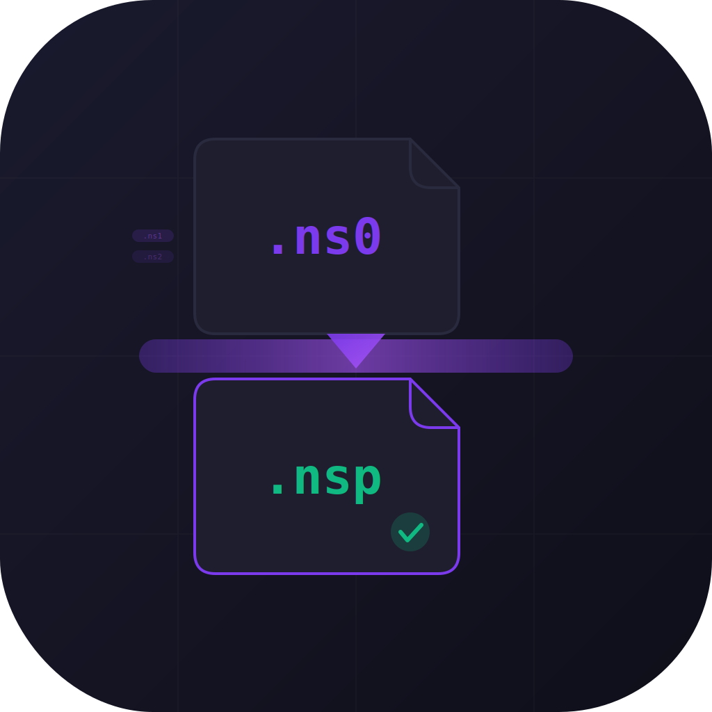

# NSP Merger

<div align="center">



**One-tap extraction and merging of split NSP files on Android.**

[](https://github.com/ekasisprog-bit/NSPMerger/releases)
[](LICENSE)
[]()

</div>

---

## What It Does

NSP Merger takes a folder full of zipped, split game dumps and turns them into clean, ready-to-use `.nsp` files. No PC required.

```
your-folder/
  game1.zip        (contains game1.ns0, game1.ns1, game1.ns2)
  game2.zip        (contains game2.nsp.00, game2.nsp.01)
  game3.zip        (contains game3.nsp)
          |
          v   [ NSP Merger ]
          |
your-folder/
  game1.nsp        (merged)
  game2.nsp        (merged)
  game3.nsp        (standalone, copied as-is)
```

## Features

- **5 split formats** supported: `.ns0/.ns1`, `.nsp.00/.nsp.01`, `.xc0/.xc1`, `.nsp.part0/.nsp.part1`, bare numbered
- **Streaming processing** with 4MB buffers -- handles 50GB+ files without running out of memory
- **Live progress** with phase indicators, file names, and byte counters
- **Automatic cleanup** -- zips and intermediates are deleted as you go
- **Disk-space aware** -- checks free space before each step
- **Dark theme UI** with a single-screen workflow

## Install

1. Download the latest APK from [**Releases**](https://github.com/ekasisprog-bit/NSPMerger/releases/latest)
2. Sideload it on your Android device (enable "Install from unknown sources" if prompted)

> **Minimum:** Android 7.0+ (API 24)

## How to Use

1. **Tap "Select Folder"** -- pick the folder containing your zip files
2. **Tap "Start Processing"** -- confirm the prompt
3. **Watch it work** -- the progress card shows the current phase, file, and progress
4. **Done** -- merged `.nsp` files appear in the same folder. Originals are cleaned up.

## Architecture

```
React Native (Expo SDK 55)
  |
  +-- TypeScript UI + Services
  |     - Pattern matching (5 split-NSP formats)
  |     - File grouping & validation
  |     - Processing pipeline orchestration
  |
  +-- Custom Kotlin Native Module (expo-modules)
        - SAF (Storage Access Framework) integration
        - Streaming ZipInputStream extraction
        - Binary file concatenation (4MB buffer)
        - Disk space checks via StatFs
```

All heavy I/O runs in native Kotlin with streaming buffers. Files never load fully into memory.

## Build from Source

### Prerequisites

- Node.js 18+
- JDK 17 (`brew install openjdk@17`)
- Android SDK (platform 35, build-tools 35.0.1)

### Steps

```bash
# Install dependencies
npm install

# Generate Android project
npx expo prebuild --platform android

# Build debug APK
export JAVA_HOME=/opt/homebrew/opt/openjdk@17/libexec/openjdk.jdk/Contents/Home
export ANDROID_HOME=~/Library/Android/sdk
cd android && ./gradlew assembleRelease

# APK output
ls -lh app/build/outputs/apk/release/app-release.apk
```

## Supported Split Formats

| Pattern | Example Files | Output |
|---------|--------------|--------|
| `.ns0, .ns1, .ns2` | `game.ns0`, `game.ns1` | `game.nsp` |
| `.nsp.00, .nsp.01` | `game.nsp.00`, `game.nsp.01` | `game.nsp` |
| `.xc0, .xc1` | `game.xc0`, `game.xc1` | `game.nsp` |
| `.nsp.part0, .nsp.part1` | `game.nsp.part0`, `game.nsp.part1` | `game.nsp` |
| Bare numbered | `00`, `01`, `02` | `merged.nsp` |

## License

MIT
